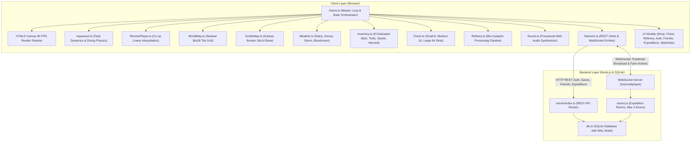
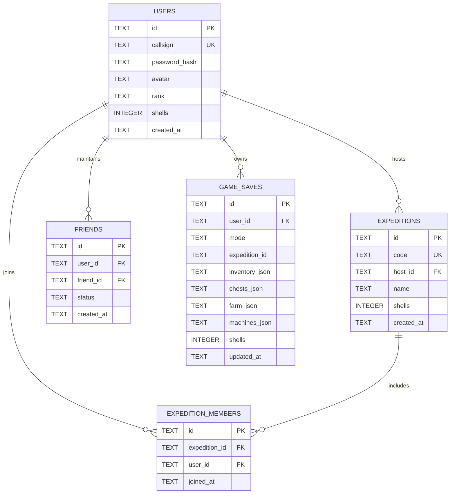

# Abyss Garden

A 2D Deep-Sea Farming, Crafting, and Multiplayer Expedition RPG built with TypeScript, HTML5 Canvas, Web Audio API, Node.js, and SQLite.

---

## Table of Contents

- [Overview](#overview)
- [System Architecture](#system-architecture)
- [Database Schema (ERD)](#database-schema-erd)
- [Core Gameplay Mechanics](#core-gameplay-mechanics)
- [Controls Reference](#controls-reference)
- [Local Setup & Development](#local-setup--development)
- [Docker Deployment](#docker-deployment)
- [REST & WebSocket API Specification](#rest--websocket-api-specification)
- [Project Directory Structure](#project-directory-structure)
- [Clean Code & Engineering Standards](#clean-code--engineering-standards)
- [License](#license)

---

## Overview

Abyss Garden is a real-time web-based simulation RPG where players assume the role of an Aquanaut cultivating bioluminescent flora across the deep ocean floor. The game incorporates a complete day/tide cycle, atmospheric weather events that induce stacked crop mutations, dynamic flora weight calculation, storage infrastructure, machinery refining, customizable diver suits, and authoritative multiplayer co-op sessions for up to four players per expedition.

---

## System Architecture

Abyss Garden employs a decoupled client-server architecture with an authoritative backend database, WebSocket room synchronization, and an HTML5 Canvas rendering pipeline.



---

## Database Schema (ERD)

The persistence tier runs on native Node.js SQLite with Write-Ahead Logging (WAL) enabled for atomic, high-performance transactions.



### Table Relationships and Constraints

1. **USERS**: Root identity entity holding diver callsign, SHA-256 hashed credentials, career rank, and solo currency.
2. **EXPEDITIONS**: Represents persistent shared expeditions with a unique 6-character access code and shared treasury balance.
3. **EXPEDITION_MEMBERS**: Junction table mapping up to four divers per expedition room with join timestamps.
4. **FRIENDS**: Bidirectional social relationships supporting diver discovery and expedition invitations.
5. **GAME_SAVES**: Partitioned player progression data keyed on `(user_id, mode, expedition_id)`. Inventory state from Solo mode cannot leak into Multiplayer Expeditions, and vice versa.

---

## Core Gameplay Mechanics

### 1. Strict 6-Slot Hotbar Architecture

The diver toolbelt is capped at strictly 6 slots (hotkeys 1 to 6) to emphasize strategic resource management:

- **Slot 1 (Sand Shovel)**: Permanent unlimited excavation tool used to till wild seabed sand into cultivable soil.
- **Slot 2 (Sand Leveler)**: Permanent unlimited tool used to flatten tilled soil back into normal seabed floor.
- **Slots 3 to 6 (Diver Backpack Slots)**: Dynamic inventory slots holding consumable items, seeds, and harvested flora:
  - **Plankton Nutrients**: Consumable growth accelerator vial. When count reaches 0 upon use or transfer, the item vanishes completely, leaving an open empty slot. Refills can be purchased from Barnaby.
  - **Spores & Polyps**: Sown directly onto tilled plots. When count reaches 0 upon planting, the slot resets to empty.
  - **Flora Harvests & Refined Goods**: Deposited directly into available backpack slots. Identical crops (same species, same stacked mutations, and matching weight) stack up to 16 per slot.
- **Capacity Enforcement**:
  - When all 6 slots are occupied and no matching stack with capacity remains, harvesting and shop purchasing are blocked with an immediate warning toast (`Inventory Full! No free slot`).
- **Clean Slot Sanitization**:
  - When any non-tool item is consumed, sold to Barnaby, or stored in a bunker chest, its metadata and icons are wiped immediately, rendering a clean empty slot.

### 2. Subsea Farming and Anti-Exploitation Rules

- **Single-Harvest Lifecycle**: Every crop in the game is single-harvest. When harvested, the plot fully resets to unseeded tilled sand. Automatic infinite regrowth has been eliminated to protect economic balance.
- **Dynamic Crop Weight**: Crops vary naturally in weight (1.0 kg to 2.5 kg). Final sell values scale linearly based on weight, granting fair increments for heavier yields without causing hyperinflation.

### 3. Weather System and Multi-Mutation Stacking

Four dynamic weather conditions cycle across the seabed:

| Weather | Visual Atmosphere | Flora Mutation | Multiplier |
|---|---|---|---|
| Rainy | Ambient downward subsea currents | Wet | x1.5 |
| Snowy | Crystalline particles with white overlay | Frozen | x2.0 |
| Storm | Darkened depths with electrical lightning flashes | Thunderbolt | x3.0 |
| Bloodmoon | Deep crimson luminescent water tint | Bloodmoon | x5.0 |

- **Sum-of-Multipliers Stacking**:
  A crop can accumulate up to all four mutations during its lifecycle if exposed to successive weather events. Multipliers are summed first before multiplying the base crop value:

  $$\text{Total Multiplier} = \sum_{m \in \text{mutations}} \text{Multiplier}(m)$$

  $$\text{Sell Value} = \text{Base Value With Weight} \times \text{Total Multiplier}$$

  *Example*: A crop carrying `Wet` (1.5x) and `Thunderbolt` (3.0x) yields a combined multiplier of `4.5x` (1.5 + 3.0). If all four mutations stack on a single specimen, the total multiplier reaches `11.5x`.
- **Animated Multi-Auras**: The canvas rendering engine renders layered procedural auras (bubbles, snowflake prisms, electric arcs, and crimson rings) for each active mutation on a crop.

### 4. Home Grotto (Subsea Bunker Base)

- Located on the far perimeter of the seabed, accessible via an illuminated airlock hatch.
- **Oxygen Recovery**: Inside the bunker, the diver's oxygen supply does not deplete and is continuously replenished.
- **3-Tier Storage Chests**:
  - Small Reef Chest: 1x1 footprint, 8 slots.
  - Medium Ironwood Chest: 2x1 footprint, 24 slots.
  - Large Abyssal Vault: 3x1 footprint, 64 slots.
- **Bio-Extractor Refinery**:
  - Converts raw harvested flora into refined commodities (Kelp Bio-Fuel, Polished Luminous Gems, Abyssal Protection Amulets, Starlight Elixirs).
- **Personal Wardrobe**:
  - Allows divers to purchase and equip distinctive suit colors (Cyan, Navy Blue, Emerald Deep, Sunset Coral, Abyssal Violet, Bio-Luminescent Golden).

### 5. Co-op Expeditions (2 to 4 Players)

- **Shared World and Treasury**: Divers in an expedition share the central expedition wallet (`expeditions.shells`), encouraging cooperative farming and investment.
- **Individual Upgrades**: Personal equipment (oxygen tank capacity, swim propulsion fins, spotlight beam, wardrobe suits, and consumable vials) are private to each diver and persist across reconnects.
- **Expedition Resumption**: Any member can enter and work an expedition world even if the host or other divers are currently offline.

---

## Controls Reference

| Action | Primary Input | Secondary Input |
|---|---|---|
| Swim Movement (All Directions) | `W` / `A` / `S` / `D` | `Arrow Keys` |
| Aim Spotlight and Target Grid | `Mouse Cursor` | - |
| Use Tool / Plant Spore / Harvest | `Left Click` | `Spacebar` |
| Switch Hotbar Slot | `1` to `6` | `Mouse Scroll Wheel` |
| Interact (Barnaby, Airlock, Chest, Refinery, Wardrobe) | `E` | `Spacebar` |
| Open Co-op Expeditions Hub | `C` | Top Navigation Bar |
| Open Diver Friends Roster | `F` | Top Navigation Bar |
| Toggle Audio Mute | `M` | Top Navigation Bar |
| Open Game Settings and Controls | `O` | Top Navigation Bar |
| Close Active Modals | `Escape` | Modal Close Button |

---

## Local Setup & Development

### Prerequisites

- Node.js 20.x or 22.x LTS
- npm 10.x or higher

### Installation

1. Clone the repository:
   ```bash
   git clone https://github.com/RyanHidayat058/AbyssGarden.git
   cd AbyssGarden
   ```

2. Install dependencies:
   ```bash
   npm install
   ```

3. Launch the backend API and WebSocket server:
   ```bash
   npm run server
   ```
   *Runs by default on `http://localhost:3001` with SQLite database initialized.*

4. Launch the frontend development server:
   ```bash
   npm run dev
   ```
   *Vite server opens at `http://localhost:5173` with automatic API and WebSocket proxying.*

5. Run production build and type checking:
   ```bash
   npm run build
   ```

---

## Docker Deployment

The application includes containerization setup via a multi-stage Docker build:

### Using Docker Compose

```bash
# Build and run containers in detached mode
docker compose up -d

# Stop and remove containers
docker compose down
```

### Manual Container Build

```bash
docker build -t abyss-garden:latest .
docker run -d -p 8080:80 --name abyss-garden abyss-garden:latest
```

---

## REST & WebSocket API Specification

### Authentication Endpoints

- `POST /api/auth/register`: Create a new diver account with callsign, password, and avatar.
- `POST /api/auth/login`: Authenticate callsign and password, returning an active session token.

### Friends & Social Endpoints

- `GET /api/friends/list`: Retrieve the authenticated diver's friend roster.
- `POST /api/friends/add`: Send a friend request by callsign.

### Expedition Management Endpoints

- `POST /api/expeditions/create`: Initialize a new multiplayer expedition world.
- `POST /api/expeditions/join`: Join an active expedition using its 6-character room code.
- `GET /api/expeditions/my`: Fetch all expeditions the diver has joined.

### Game State Persistence Endpoints

- `POST /api/data/save`: Save inventory, farm plots, chests, and refinery states for solo or co-op mode.
- `GET /api/data/load`: Retrieve saved state partitioned by `(mode, expeditionId)`.

### WebSocket Real-time Events (`/ws/multiplayer`)

- `join_expedition`: Connect diver session to an expedition room.
- `move`: Broadcast diver coordinate `(x, y)`, velocity vectors, facing angle, map ID, and equipped suit.
- `farm_action`: Broadcast plot interactions (`till`, `untill`, `plant`, `nutrient`, `harvest`) with coordinates and mutation metadata.
- `weather_change`: Synchronize weather states and remaining duration across all connected clients.
- `suit_change`: Synchronize diver suit alterations in real time.
- `chat`: Broadcast text communication among divers within the expedition.

---

## Project Directory Structure

```
AbyssGarden/
├── server/
│   ├── db.ts                     # SQLite schema definitions, migrations, and CRUD helpers
│   ├── rooms.ts                  # WebSocket room management and broadcaster (max 4 per room)
│   └── index.ts                  # Express REST router and WebSocket server bootstrap
├── src/
│   ├── main.ts                   # Client application entrypoint
│   ├── style.css                 # Glassmorphism styling and oceanic UI layouts
│   ├── core/
│   │   ├── Game.ts               # Master coordinator, update/render loop, and event broker
│   │   ├── Network.ts            # HTTP REST client and WebSocket event dispatcher
│   │   ├── Input.ts              # Keyboard, mouse, and wheel input listener (keys 1-9)
│   │   ├── Camera.ts             # 2D camera viewport follow, smoothing, and bounds clamping
│   │   ├── Sound.ts              # Procedural Web Audio synthesizer (ambient, sfx, chords)
│   │   └── Account.ts            # Diver profile caching and session management
│   ├── world/
│   │   ├── WorldMap.ts           # 36x28 seabed tile map, bunker airlock entrance, hydrothermal vents
│   │   ├── GrottoMap.ts          # 18x14 interior base map, oxygen replenishment, chest positioning
│   │   ├── Weather.ts            # Dynamic weather engine, mutation rollers, and pricing formulas
│   │   ├── Lighting.ts           # 2D destination-out canvas composite lighting and diver spotlights
│   │   └── Particles.ts          # Oceanic bubble simulation, marine snow, and floating notifications
│   ├── entities/
│   │   ├── Aquanaut.ts           # Player diver physics, suit rendering, and grid targeting
│   │   ├── RemotePlayer.ts       # Networked co-op diver entity with linear positional interpolation
│   │   ├── Chest.ts              # 3-tier storage chests (Small 8, Medium 24, Large 64 slots)
│   │   ├── MerchantCrab.ts       # Barnaby the Hermit Crab NPC entity and animation
│   │   └── AmbientFish.ts        # Decorative fauna (lantern fish, rays) with flocking behaviors
│   ├── farming/
│   │   ├── Crops.ts              # Flora configurations, seed icons, and growth parameters
│   │   ├── FarmPlot.ts           # Plot state machine (tilled, un-tilled, planted, mature, multi-mutation)
│   │   ├── Refinery.ts           # Bio-Extractor state machine and recipe definitions
│   │   └── Inventory.ts          # 9-slot inventory layout, consumable nutrients, and slot sync
│   └── ui/
│       ├── HUD.ts                # Real-time HUD, oxygen meter, tide clock, and hotbar slots
│       ├── ChestModal.ts         # Two-way chest storage transfer interface
│       ├── RefineryModal.ts      # Bio-Extractor processing and collection modal
│       ├── ExpeditionsModal.ts   # Create, join by code, and resume co-op expeditions
│       ├── FriendsModal.ts       # Friends list and co-op expedition invitations
│       ├── WardrobeModal.ts      # Diver suit customization and catalog interface
│       ├── AuthModal.ts          # Diver login and account creation modal
│       ├── ShopModal.ts          # Barnaby's shop (Spores, Gear, Chests, Sell)
│       └── SettingsModal.ts      # Audio mixer and keybinding overview
├── Dockerfile                    # Multi-stage production container build
├── docker-compose.yml            # Container orchestration manifest
├── nginx.conf                    # Nginx reverse proxy configuration for static distribution
├── package.json                  # Project dependencies and operational scripts
└── tsconfig.json                 # TypeScript compiler configuration (strict mode)
```

---

## Clean Code & Engineering Standards

- **Strict Typing**: Strict TypeScript mode enabled across both frontend and backend (`strict: true`, zero implicit `any` in core domains).
- **Single Responsibility Principle**: Systems (Audio, Network, Physics, Weather, Storage, Inventory) are isolated into dedicated modules with discrete public contracts.
- **Zero Asset Bloat**: Procedural generation for audio (Web Audio API synthesis) and rendering (pure HTML5 Canvas paths and composite operations) without external binary sprite sheets or audio files.
- **Decoupled State**: Farm plots and inventory models are independent of rendering code, enabling straightforward serialization, synchronization, and automated testing.
- **Zero AI Artifacts**: Repository excludes any AI assistant caches, model configuration files, local logs, temporary runtime databases, and platform-specific crash dumps.

---

## License

This project is licensed under the [MIT License](LICENSE).
